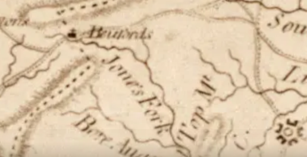

# Deciphering Beale Cipher 1: A Comprehensive Statistical, Geographical, and Historical Analysis

by William Duckworth.

**[Read the original paper (PDF)](deciphering-beale-cipher-1.pdf)** · 7 pages · February 2025

---

## Abstract

This paper documents a previously-uncatalogued numerical pattern inside Beale Cipher 1. When the 520-number cipher is concatenated into a digit stream and segmented into sequential 2-digit pairs, two triplets appear that read as a Degrees–Minutes–Seconds coordinate. The coordinate lies in Bedford County, Virginia — the county Cipher 2's plaintext names as the location of the buried deposits — and lands near a historically named landmark.

The paper presents the pattern, the arguments that support reading it as a meaningful encoding, and the arguments that challenge that reading. Both columns of evidence are laid out in full. All numerical and geographic results are reproducible via seven self-contained Python scripts accompanying this paper.

The evidence is presented in full, and the paper does not advance a conclusion as to which reading the cipher supports. This paper does not claim to have solved Beale Cipher 1.

---

## 1. The Pattern

Beale Cipher 1 is a list of 520 numbers transcribed from *The Beale Papers* (Ward, 1885). Concatenated, the digits form a 1,336-character string. Segmented into sequential 2-digit pairs beginning at offset 0, this produces 668 pairs.

Two triplets appear in the pair stream that read as Degrees–Minutes–Seconds coordinates:

- **Latitude:** `[37, 12, 21]` at pair index 246 → **37° 12' 21" N**
- **Longitude:** `[79, 23, 16]` at pair index 598 → **79° 23' 16" W**

Together: **37° 12' 21" N, 79° 23' 16" W**. This coordinate lies inside Bedford County, Virginia.

The cipher also contains a second valid Bedford-range longitude triplet `[79, 36, 44]` at pair index 609, producing an alternate coordinate at 37° 12' 21" N, 79° 36' 44" W.

### How each triplet sits inside the cipher numbers

Both triplets are recovered by the same procedure: concatenate the 520 cipher numbers into a 1,336-character digit string, segment into sequential 2-digit pairs starting at offset 0, search for the target triplets. No different rule is applied to either.

The triplets differ in how the 2-digit pairs line up with the original cipher numbers.

**Longitude triplet `[79, 23, 16]`.** Cipher numbers at positions 466, 467, 468 are `79`, `23`, `16` — each is 2 digits long, so the 2-digit pairs line up exactly with them.

```
Position in cipher list:   464   465   466   467   468   469   470
Cipher number value:        84    16    79    23    16    81    122

Concatenated digits:        ... 8 4 1 6 | 7 9 | 2 3 | 1 6 | 8 1 1 2 2 ...
2-digit pair boundaries:    ...  84  16   [79] [23] [16]  81  ...
                                            └────────┬────────┘
                                             pair indices 598, 599, 600
```

Because all three components are 2-digit cipher numbers in sequence, the triplet `79, 23, 16` is also a literal substring of the original 520-number list.

**Latitude triplet `[37, 12, 21]`.** Cipher numbers at positions 191, 192, 193 are `37`, `122`, `113` — 2, 3, and 3 digits long. The 2-digit pairs therefore cut through `122`.

```
Position in cipher list:   189   190   191   192   193   194   195
Cipher number value:       195   320    37   122   113     6   140

Concatenated digits:        ... 1 9 5 3 2 0 | 3 7 | 1 2 | 2 1 | 1 3 6 1 4 0 ...
2-digit pair boundaries:    ...  19  53  20   [37] [12] [21]  13  61  40  ...
                                                └────────┬────────┘
                                                 pair indices 246, 247, 248
```

- Pair 246 = `37` (the full cipher number at position 191)
- Pair 247 = `12` (the first two digits of cipher number `122`)
- Pair 248 = `21` (the last digit of `122` plus the first digit of `113`)

The triplet `[37, 12, 21]` is recovered by the 2-digit segmentation, but it does not appear as three consecutive entries in the original 520-number list — direct search of `cipher_numbers[i:i+3] == [37, 12, 21]` returns no match anywhere in the cipher.

### Column alignment in a 2-D grid

The pair-index separation between the two triplets is **D = 352**. This value factorizes as:

- 352 = 8 × 44
- 352 = 11 × 32
- 352 = 16 × 22

When the 668-pair cipher is laid out as a 2-D grid of width 22, 32, or 44, both triplets fall in the same column. Sample at width 22:

```
COL:        0   1   2   3   4   5   6   7   8   9  10
ROW 11 :   36  19  53  20 [37][12][21] 13  61  40  81   <-- Latitude row (pair index 246)
ROW 27 :   11  01  84  16 [79][23][16] 81  12  23  24   <-- Longitude row (pair index 598)
```

The same alignment reproduces at widths 32 and 44.

---

## 2. Arguments Supporting a Meaningful-Pattern Reading

The following features of the data are consistent with the pattern being meaningful rather than coincidental.

### 2.1 The coordinate is a valid Bedford County DMS coordinate

37° 12' 21" N, 79° 23' 16" W lies inside Bedford County, Virginia. Bedford County is explicitly named in the plaintext of Cipher 2 as the location of the buried deposits. The cipher therefore produces a coordinate that geographically agrees with the cipher's own stated burial region.

### 2.2 Both triplets are recovered by the same uniform methodology

The 2-digit segmentation that recovers the latitude also recovers the longitude. No special rule, offset shift, or alternate segmentation is required for either half.

### 2.3 The specific triplets are rare under naive null distributions

Monte Carlo testing of how often *the two specified triplets* `[37,12,21]` and `[79,23,16]` co-occur in a randomized 668-pair string:

| Null distribution | Joint occurrences |
|---|---|
| A — token-level permutation of the cipher's own 520 numbers (100,000 trials) | 0 |
| B — random uniform-digit strings of length 1,336 (100,000 trials) | 0 |

95% Clopper-Pearson upper confidence bound on the joint rate: approximately **3 in 100,000** under either null.

### 2.4 Column alignment under multiple divisor-derived grid widths

D = 352 is divisible by 22, 32, and 44 — three distinct grid widths under which the two triplets fall in the same column. The widths are not independent parameters: they are divisors of the observed D. Within that structural constraint, alignment at each available divisor width is a feature of the separation distance.

### 2.5 The coordinate lands near a real, named historical landmark

Reverse geocoding of 37° 12' 21" N, 79° 23' 16" W places it:

- **Address vicinity:** Near 2127 Preston Mill Road, Huddleston, VA 24104, Bedford County
- **Nearest named GNIS feature:** Preston Millpond (reservoir, GNIS ID 1472780), approximately 0.19 miles east
- **USGS topographic quadrangle:** Huddleston, VA (1:24,000)
- **County:** Bedford (confirmed via OpenStreetMap Nominatim, Wikipedia, county records)

A historic **Preston Mill**, originally built in the 1770s as a water-powered flour mill on Orrix Creek, still stands at 2127 Preston Mill Road. The site has documented historical association with the Preston family, who held land in the Huddleston area through the 19th and early 20th centuries (Preston-Pollard-Mattox-Hillsman-Austin Cemetery #6, near Huddleston).

The coordinate is not pointing into empty woodland — it points to a documented, named site with a historical family lineage.

### 2.6 Convergence of multiple aligned features

The pattern combines several aligned features simultaneously: a valid DMS coordinate format, two triplets recovered by a single methodology, falling in the county the cipher's own plaintext names, column-aligned at three grid widths, and landing on a named historical landmark. Each feature alone could be coincidental; their convergence is the basis for the pattern being worth documenting.

---

## 3. Arguments Challenging the Reading

The following features of the data are challenges to reading the pattern as a meaningful 1820s-era encoding.

### 3.1 Broader Monte Carlo gives a much higher base rate

The Section 2.3 test asks how often *the two specified triplets* co-occur. A different question is: how often does *any* valid Bedford County DMS coordinate pair appear in a random 668-pair string?

| Metric | Null A (token perm) | Null B (uniform digits) | Real cipher |
|---|---|---|---|
| Mean joint coord pairs | 0.46 | 1.83 | 2 |
| Fraction with ≥1 joint pair | 27.6 % | 54.9 % | yes |
| Fraction with ≥1 **column-aligned** pair under {22, 32, 44} | **3.15 %** | **11.27 %** | yes |

Between 28 % and 55 % of random strings contain *some* Bedford coordinate pair. With column-alignment under the named widths added, the rate drops to 3 % under token permutation and 11 % under uniform digits. The cipher's finding sits in the tail of these distributions — unusual but within the range of what random Bedford-coord searches produce, roughly 1-in-9 to 1-in-30 under the right null.

The "≤ 3 × 10⁻⁵" figure from Section 2.3 answers a narrow fixed-target question; the 3–11 % figure answers the broader question of how often the cipher's general pattern type appears by chance.

### 3.2 Geographic enumeration: rare, but not unique

Enumerating all 3,891,961 DMS coordinate pairs at 1-arcsecond resolution within a Bedford County rectangle (37°00'00"–37°30'00" N × 79°09'00"–79°45'00" W), exactly two land both triplets in the cipher:

| Coordinate | D | Column-aligned at width 22/32/44 |
|---|---|---|
| 37° 12' 21" N, 79° 23' 16" W | 352 | yes |
| 37° 12' 21" N, 79° 36' 44" W | 363 | no |

The 79° 23' 16" coordinate is the only column-aligned one of the two — supporting its specificity — but the existence of a second valid Bedford coordinate at all means the cipher does contain more than one pattern that fits the "Bedford DMS" template.

(The county polygon is approximated as a rectangle in this enumeration; the two hits lie inside the polygon as well, so the result is conservative for the uniqueness argument.)

### 3.3 Structural asymmetry between the two triplets

Although both triplets are recovered by the same 2-digit segmentation, they differ structurally:

- The longitude `[79, 23, 16]` is also a literal substring of the original 520-number cipher list (`cipher_numbers[466:469] = [79, 23, 16]`).
- The latitude `[37, 12, 21]` is not a substring of the cipher list (`cipher_numbers[191:194] = [37, 122, 113]` under standard 0-indexed Python — the diagram in Section 1 uses the same convention, so the value `37` sits at index 191), and exists only in the digit-pair reading.

Under a uniform encoding mechanism, both halves of a planted coordinate would typically be expected to surface under the same form. The mixed result here — one half also visible as a substring, the other half visible only through cross-token segmentation — is a structural feature of the data that any encoding hypothesis must account for.

### 3.4 The grid widths are post-hoc divisors of the observed separation

The grid widths {22, 32, 44} are not independent parameters tested against the cipher — they are the divisors of D = 352, identified after the separation was observed. Column alignment under these widths is therefore an algebraic consequence of D = 352 itself, not an independent statistical confirmation.

### 3.5 The geographic site is structurally inconsistent with the burial narrative

Cipher 2's plaintext describes burying approximately 4 tons of precious metal in iron pots, six feet below ground, across two deposits in 1819 and 1821:

| Deposit | Year | Gold | Silver |
|---|---|---|---|
| First | 1819 | 1,014 lbs | 3,812 lbs |
| Second | 1821 | 1,907 lbs | 1,288 lbs + jewels |

A 1770s-origin working flour mill on a named creek, with farmers arriving with grain and mill workers on site, is a poor match for clandestine burial of this volume of material. Moving roughly two tons of metal per deposit requires heavy wagons, draft teams, and sustained physical labor over hours — not the kind of activity that goes unobserved within sight of an active commercial site, and not the kind of activity that leaves no trace in two years of mill records, family correspondence, or community memory. (Continuous operation specifically in 1819 is inferred from the mill's documented 1770s origin and continued use through the late 19th and 20th centuries rather than from a specific 1819 deed or ledger entry; no source in the literature reviewed indicates the mill was defunct in the 1819–1821 window.)

The coordinate landing on a real Bedford landmark does not by itself imply that landmark was the burial site.

### 3.6 The cipher's plaintext spelling matches 1885, not the 1820s

Cipher 2's raw decrypted plaintext uses the form **bufords** (lowercase, no apostrophe) when referring to the Bedford County landmark used as a geographic anchor.

Three distinct spellings of the family name are in play across the relevant period sources:

| Source | Spelling |
|---|---|
| Cipher 2 (raw decryption) | `bufords` |
| Madison Map of Virginia, 1807 | `Beufords` |
| Modern attribution (later literature) | `Buford's Tavern` |

The **Madison Map of Virginia** (Rev. James Madison, *A Map of Virginia formed from actual surveys*, 1807, lower center sheet covering Bedford County) — the period's most prominent published Virginia map — labels the Buford-family-associated feature as **Beufords**.



The 1885 Ward pamphlet itself uses **Bufords** (title: "NEAR BUFORDS, IN BEDFORD COUNTY, VIRGINIA"; narrative: *Buford's Tavern*, *Buford's*). The cipher's plaintext spelling matches Ward's 1885 spelling, not the 1820s Madison Map standard.

A cipher composed in 1819–1822 with the Madison Map as a standard available source would more plausibly use the contemporary *Beufords*. The match to Ward's 1885 spelling is positive evidence consistent with composition in or near 1885.

(Cipher 2's plaintext does contain other irregularities — *foirmiles*, *poindsofsilver*, *rhousand*, *varlt*, *secirelY* — but these are transcription typos and inconsistent capitalization within otherwise period-correct words. *bufords* is qualitatively different: it reflects a documented orthographic shift in the family name between the 1820s and the late 19th century.)

Because this analysis has no independent evidence tying the cipher plaintext *bufords* to the later Locust Level / Buford's Tavern tradition, that tavern is excluded as a controlling reference point in this study. If future historical evidence demonstrates that the same site was called *bufords* in the 1819–1822 context, that referent can be restored.

### 3.7 No documented Thomas Beale matching the narrative

Independent verification of Thomas J. Beale as a real person matching the 1885 pamphlet's description (a Virginia frontiersman who organized a western expedition c. 1817–1820, deposited gold in Bedford County in 1819 and 1821, sent ciphers to Robert Morriss in 1822):

| Question | Result |
|---|---|
| Thomas Beale in 1810/1820/1830 VA census matching the narrative | None matching. Various Thomas Beales exist in census records, but none fit the Virginia frontiersman-adventurer profile |
| Virginia property records / deeds tied to a matching Beale | None found in exhaustive searches (Nelson, NSA Beale Cypher Study Committee) |
| Contemporary documentation of the western expedition | None outside the 1885 pamphlet itself |
| Beale-Preston family connection 1810s-1820s | None documented |
| Independent record of Beale-Morriss contact | None. The pamphlet's claim that Beale met Morriss "in January 1820, while keeping the Washington Hotel" contradicts the timeline that Morriss did not lease the Washington Hotel until approximately 1823 |

### 3.8 Scholarly stylometric and linguistic literature

Published analyses by:

- **Joe Nickell**, *Virginia Magazine of History and Biography* 90:3 (1982), "Discovered: The Secret of Beale's Treasure" — documents linguistic anachronisms (e.g., *stampeding*, *improvised*) and stylometric linkage of the "Beale" letters and Cipher 2 plaintext to James B. Ward
- **Louis Kruh**, *Cryptologia* 6:4 (1982) "A Basic Probe of the Beale Cipher as a Bamboozlement," Part II 12:4 (1988) — statistical analysis of punctuation, grammar, and vocabulary concluding single author
- **Jim Gillogly**, *Cryptologia* 4:2 (1980), "The Beale Cipher: A Dissenting Opinion" — documents pseudo-alphabetical sequences in Cipher 1 inconsistent with genuine plaintext encryption
- **Carl Hammer** (UNIVAC analyses, c. 1970, *Cryptologia* 1981) — found non-random structure in Ciphers 1 and 3 without affirmatively authenticating the story or Beale's existence

The scholarly consensus from these works is that the framing texts (introduction, "Beale" letters, deciphered Cipher 2 plaintext) share a single author, plausibly James B. (Beverly) Ward (1822–1909), who copyrighted the 1885 pamphlet as "agent for the author." Ward had documented Lynchburg/Campbell County residence, Masonic membership (Dove Lodge, ~1862/3), and family connections to the Robert Morriss circle through his wife Harriet Emmaline Buford Otey.

---

## 4. Two Interpretations of the Evidence

The arguments in Sections 2 and 3 are both grounded in the same data. They support two different readings of what the pattern is.

### Interpretation A: A meaningful encoding

Under this reading, the pattern in Section 1 could reflect deliberate construction by someone in or around the narrative period who embedded coordinates into Cipher 1 using a 2-digit segmentation scheme. The supporting case from Section 2:

- The coordinate is a valid DMS in the cipher's own stated burial region
- A single uniform methodology recovers both triplets
- The 0/100,000 joint null rate for the two specified triplets makes their co-occurrence vanishingly unlikely as a coincidence under naive testing
- Column alignment is present under multiple divisor-derived grid widths
- The coordinate lands near a real, named, historically associated site

Under this reading, the items in Section 3 are challenges to be addressed (the busy-mill problem, the spelling, the missing Beale documentation) but not necessarily decisive — they may admit alternative resolutions, including the possibility that surviving records simply do not capture all 19th-century Bedford County activity.

### Interpretation B: Noise or 1885 fabrication artifact

Under this reading, the pattern in Section 1 is either a coincidence at the 3–11 % base rate identified in Section 3.1, or a feature of an 1885 fabrication authored or assembled by James B. Ward. The supporting case from Section 3:

- The broader Monte Carlo places the pattern within the range of what random Bedford-coord searches produce
- The structural asymmetry between the two triplets is not what uniform-mechanism encoding would predict
- The grid widths are post-hoc divisors of the observed D
- The geographic site is structurally wrong for the burial narrative as described
- The cipher plaintext spelling aligns with 1885 Ward usage, not 1820s Madison Map orthography
- No independent historical record of Thomas Beale matching the narrative exists
- Stylometric literature attributes the framing texts to a single 1885 author

Under this reading, the items in Section 2 are real but explainable: the coordinate's existence is a noise artifact that happens to land in Bedford County (which has 28–55 % base rate); the column alignment is an algebraic consequence of D = 352 having multiple small divisors; the landmark match is one of many in a county-sized search region.

### What would distinguish the two interpretations

Neither reading is forced by the data presented here. The following kinds of future evidence would help distinguish them:

- **Cipher 3 analysis under the same methodology.** If Cipher 3 also contains an embedded coordinate pattern under 2-digit segmentation, Interpretation A is strengthened (the encoding scheme is reproducible across ciphers); if not, Interpretation B is strengthened (the Cipher 1 pattern is a one-off).
- **Length-distribution analysis of Cipher 1.** Whether the distribution of 2- vs 3-digit cipher numbers in the latitude region shows the non-random structure required to make the cross-token stitching produce `[37, 12, 21]` rather than nearby alternatives.
- **Primary-source archival evidence.** Documentation of Thomas Beale matching the narrative, of a Beale-Preston connection, or of Ward's working notes, would directly bear on which reading the historical record supports.
- **Independent geographic verification.** Bedford County records (deeds, surveys, oral history) tied specifically to 2127 Preston Mill Road and the 1819–1822 window.

---

## 5. Caveats and Limits of the Analysis

- **The 2-digit segmentation is a researcher choice.** Three of six (length × offset) variants tested also recover both target digit strings; only the published 2-digit-at-offset-0 version produces them as DMS-structured triplets.
- **The asymmetry between the two triplets is real** (Section 3.3) and any encoding hypothesis must account for it.
- **The grid widths {22, 32, 44} are post-hoc divisors of D = 352**, not independent parameters.
- **The Texas Sharpshooter test uses bounds slightly looser** than the strict Geographic Null Test (~3 % larger expected counts); does not change conclusions.
- **The cipher contains two valid Bedford-range longitude triplets** at pair indices 598 and 609.
- **The historical research is text-based.** Bedford County and Bedford Museum unindexed archives may contain primary records not surfaced by digital sources. The historical consensus could in principle be revised by new primary-source discoveries.
- **Geographic coverage assumes a rectangular Bedford County proxy** (37°00'00"–37°30'00" N × 79°09'00"–79°45'00" W). Both cipher hits lie inside the actual county polygon as well.

---

## 6. Reproducibility — Seven Scripts

All seven scripts are self-contained, depend only on the Python standard library, and embed the cipher's 520-number sequence directly. Each can be executed with `python3 <script_name>.py`.

1. **`Replicate_Beale_Findings.py`** — confirms target triplets at pair indices 246 and 598; reports D = 352 and divisor list; shows source cipher numbers
2. **`Monte_Carlo_Null_Test.py`** — 100,000 trials under each of two null distributions; reports Clopper-Pearson UCB on the specific-triplet joint rate (Section 2.3 figures)
3. **`Texas_Sharpshooter_Test.py`** — broader Monte Carlo testing any valid Bedford coord pair, with and without column-alignment filter (Section 3.1 figures)
4. **`Geographic_Null_Test.py`** — enumerates ~3.9 million DMS coordinate pairs in the Bedford County rectangle; reports joint hits under multiple grid-width criteria (Section 3.2)
5. **`Segmentation_Sensitivity_Test.py`** — tests (length × offset) variants of 2-digit pairing; reports which configurations recover both targets
6. **`beale_coordinate_grid_view.py`** — renders the cipher as a 2-D grid at widths 22, 32, 44 with the target triplets bracketed in their shared column
7. **`Bufords_4Mile_Search.py`** — enumerates all DMS coordinates within a 4-mile circle of one candidate Buford's reference (Locust Level) and reports cipher matches

---

## Source of the Cipher

This analysis uses the canonical 520-number transcription of Beale Cipher 1 from *The Beale Papers* (J. B. Ward, 1885), standardized across modern transcriptions including Hammer (c. 1970). The full number sequence is embedded in each of the seven scripts and produces 1,336 total digit characters when concatenated.

## Selected References

- Ward, J. B. (1885). *The Beale Papers: Containing Authentic Statements Regarding the Treasure Buried in 1819 and 1821, near Bufords, in Bedford County, Virginia, and Which Has Never Been Recovered*. Lynchburg, VA: Virginian Book and Job Print.
- Madison, J. (1807). *A Map of Virginia formed from actual surveys, and the latest as well as most accurate observations*. Richmond, VA. Lower center sheet covering Bedford County.
- Nickell, J. (1982). "Discovered: The Secret of Beale's Treasure." *Virginia Magazine of History and Biography* 90(3): 310–324.
- Kruh, L. (1982). "A Basic Probe of the Beale Cipher as a Bamboozlement." *Cryptologia* 6(4): 378–382; (1988) Part II *Cryptologia* 12(4): 241–246.
- Gillogly, J. (1980). "The Beale Cipher: A Dissenting Opinion." *Cryptologia* 4(2): 116–119.
- Hammer, C. (c. 1970 / 1981). UNIVAC analyses of Beale Cipher structure; *Cryptologia* (1981).

## Citing

> Duckworth, W. *Deciphering Beale Cipher 1: A Comprehensive Statistical, Geographical, and Historical Analysis.* 2025.

## License

Released under the [Creative Commons Attribution 4.0 International License (CC BY 4.0)](https://creativecommons.org/licenses/by/4.0/).
